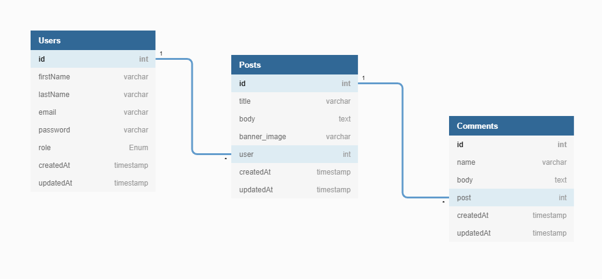

# Blog RESTful API

> This is a minimal blog api with some advance features developed using NodeJS, ExpressJS and MongoDB. If you are looking for a free RESTful API to interact with feel free to use this. It's open source.

## Features

- Authentication with JWT (Reset Password with email)
- User Create, Read, Update and Delete (CRUD) operations
- CRUD operations for blog post including uploading banner image for post
- Visitors can leave a comment
- Pagination and search where necessary
- API Security (NoSQL Injections, XSS Attacks, http param pollution etc)

## API Documentation

Hosted on netlify: [Blog API](https://blog-api-docs-77ae6a.netlify.com/)

Extensive and testing documentation with postman: [Blog API](https://documenter.getpostman.com/view/9407876/SWLmX4jq?version=latest)

## Database Model

Though the diagram uses sql data type, this diagram is to show you the various collections in the mongo database.



## Requirement

- NodeJS
- MongoDB

## Configuration File

Modify the config/.env file to your environment variables, set your JWT_SECRET and SMTP variables

```ENV
NODE_ENV=development
PORT=3001

MONGO_URI=YOUR_URL

JWT_SECRET=YOUR_SECRET
JWT_EXPIRE=30d
JWT_COOKIE_EXPIRE=30

SMTP_HOST=smtp.mailtrap.io
SMTP_PORT=2525
SMTP_EMAIL=
SMTP_PASSWORD=
FROM_EMAIL=noreply@boilerplate.com
FROM_NAME=Boilerplate
```

Email testing: use mailtrap for email testing, it's easy no stress.

## Installation

Install all npm dependecies

```console
npm install
```

Install nodemon globally

```console
npm install -g nodemon
```

Run database seeder

- Seeder folder is \_data/
- Edit the seeder file if you want to

```console
node seeder -i
```

Delete all data

```console
node seeder -d
```

## Start web server

```console
node run dev
```

## License

This project is licensed under the MIT License

## Developed by Reagan Ekhameye (Tech Reagan)

Reach me on twitter [@techreagan](https://www.twitter.com/techreagan)
